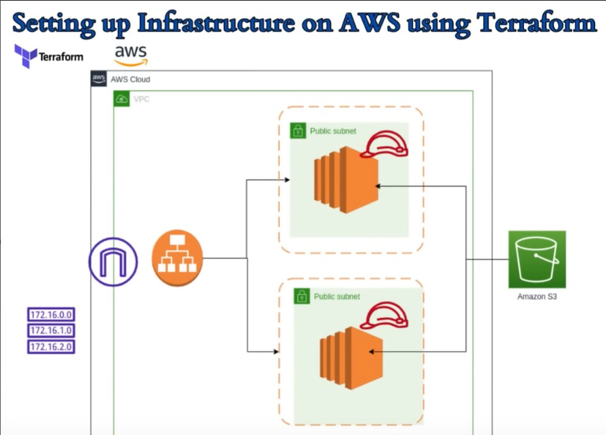

# 🌩️ AWS Infrastructure with Terraform

This project demonstrates how to **provision and manage AWS infrastructure using Terraform** — following Infrastructure-as-Code (IaC) best practices.

It creates a **complete, production-style environment** including a custom VPC, public subnets, EC2 instances, a load balancer, and an S3 bucket.  
This setup can serve as a solid foundation for deploying web applications on AWS.

---

## 🚀 Project Overview

### Resources Provisioned
| Category | Resource | Description |
|-----------|-----------|-------------|
| **Networking** | VPC | Custom VPC with CIDR block `10.0.0.0/16` |
|  | Subnets | Two public subnets in different AZs (`us-east-1a`, `us-east-1b`) |
|  | Internet Gateway | Provides internet access for public subnets |
|  | Route Table | Configured to route internet traffic via IGW |
| **Security** | Security Group | Allows inbound HTTP (80) and SSH (22) |
| **Compute** | EC2 Instances | Two t2.micro web servers with user data scripts |
| **Load Balancer** | Application Load Balancer | Distributes HTTP traffic to both EC2 instances |
| **Storage** | S3 Bucket | Simple demo bucket for static storage |
| **Outputs** | ALB DNS Name | Terraform output displays the DNS endpoint of the load balancer |

---

## 🧱 Architecture Diagram

